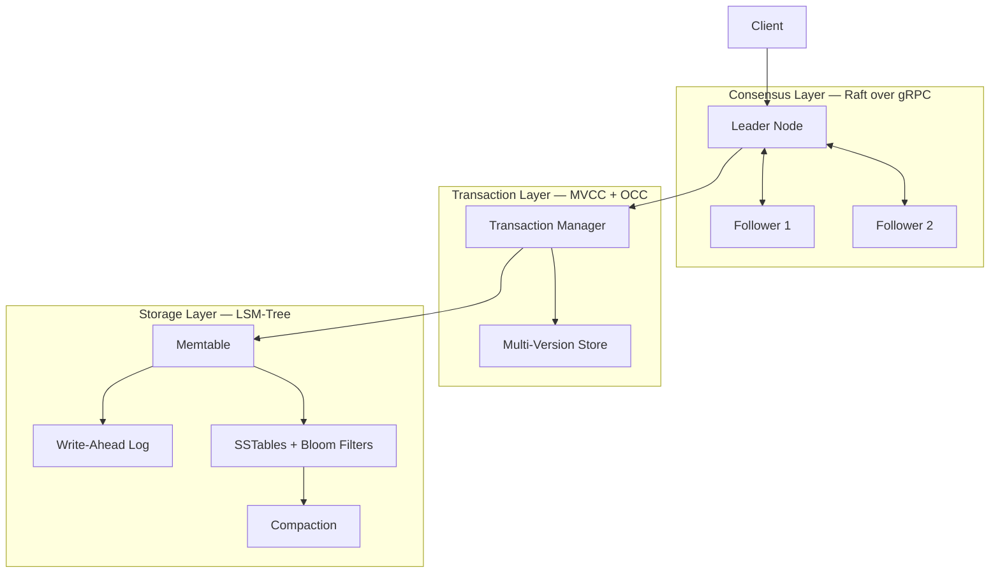
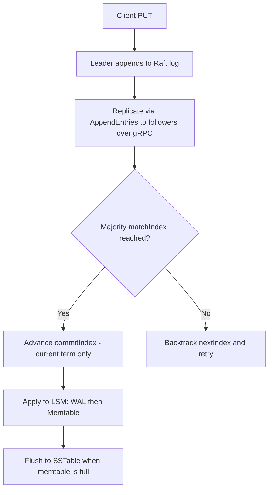
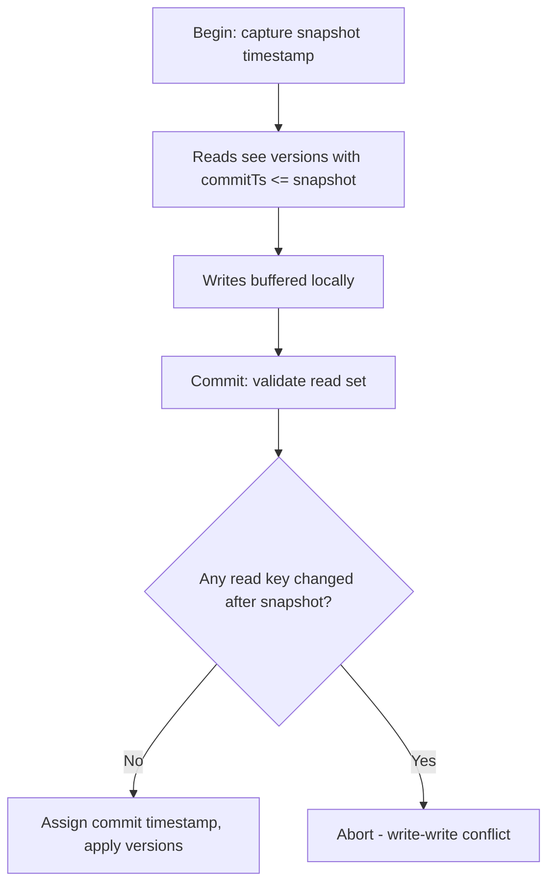
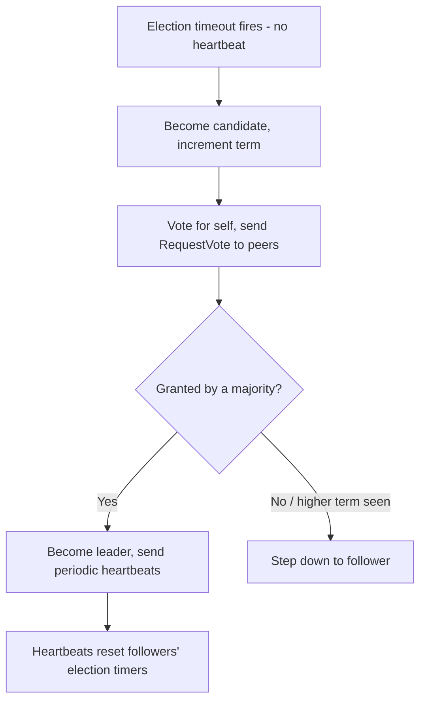
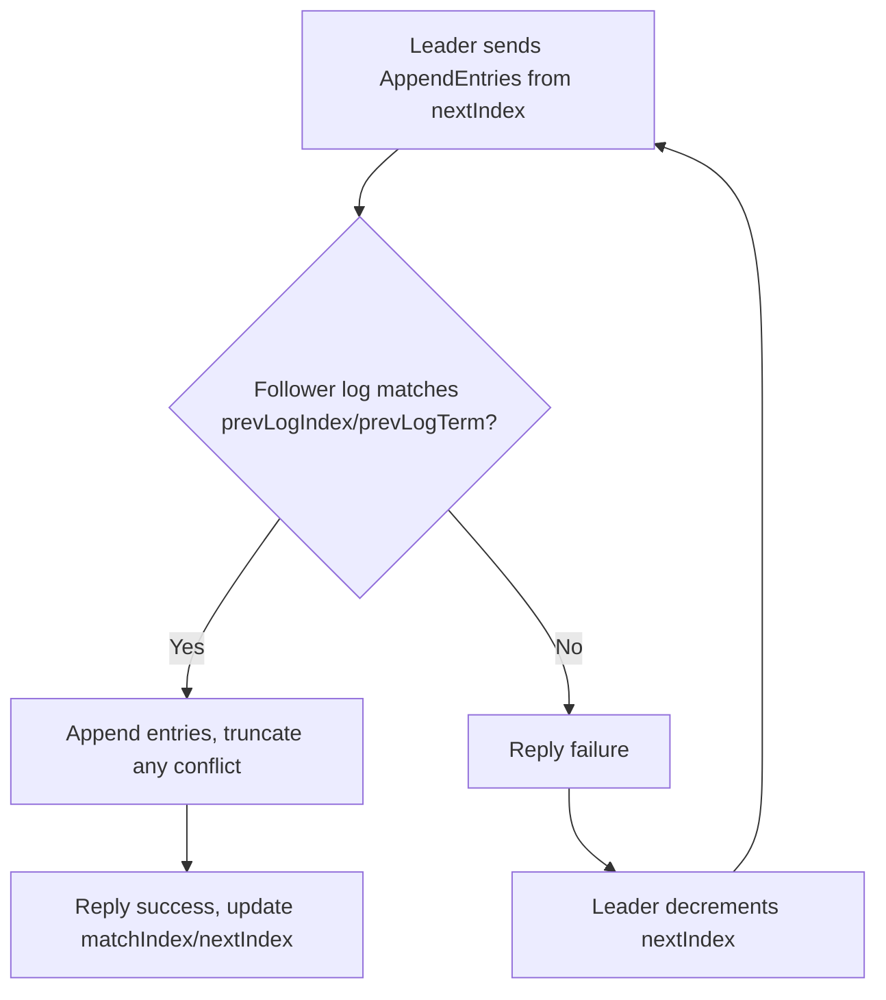

# VeritasDB — A Distributed Transactional Key-Value Store in Java

**VeritasDB** is a distributed, transactional key-value store built from scratch in **Java 17**. It combines a custom **Raft consensus** implementation for replication, an **LSM-tree storage engine** for durable writes, and **MVCC transactions** for snapshot-isolated, conflict-detecting concurrency — and runs as a real multi-process cluster over **gRPC** with automatic leader election and failover. It demonstrates how production systems (etcd, CockroachDB, Cassandra) achieve durability, consistency, and concurrency.

## Motivation

Distributed databases must stay consistent and available under failure while offering transactional guarantees. VeritasDB separates these concerns into three layers:

- **Storage layer (LSM-tree)** — high write throughput, durability via a write-ahead log.
- **Transaction layer (MVCC + OCC)** — snapshot-isolated reads that never block writers, with optimistic conflict detection at commit.
- **Consensus layer (Raft)** — a replicated command log so every node applies operations in identical order, with automatic leader election, log-conflict resolution, and failover.

## Key Features

- **LSM-tree storage engine** — in-memory memtable, write-ahead log, immutable on-disk SSTables, compaction, and Bloom filters for fast negative lookups.
- **Crash recovery** — the WAL is replayed on startup; SSTables are discovered and reloaded.
- **MVCC transactions** — multi-version concurrency control providing snapshot isolation; reads see a consistent point-in-time view and never block writers.
- **Optimistic concurrency control** — read-set validation at commit detects write-write conflicts and aborts the losing transaction.
- **Raft consensus** with:
  - Leader election with terms, majority voting, and the log up-to-date restriction.
  - **Automatic elections and heartbeats** via randomized timers — hands-off failover.
  - **Full log-conflict resolution** — per-follower `nextIndex`/`matchIndex` with backtracking, follower log truncation, and the current-term commit-safety rule.
  - **Durable Raft state** — term, votedFor, and log persisted to disk and reloaded on restart.
- **Real multi-process cluster over gRPC** — nodes elect a leader and replicate the log across the network; the Raft algorithm is transport-agnostic (in-memory for tests, gRPC in production).
- **Comprehensive tests** — storage, flush/recovery, Bloom filters, compaction, transaction isolation/conflicts, Raft election/replication/failover, persistence, timers, and log-conflict convergence.

## Architecture



## Request Flows

### Write Path



### Transaction Path (MVCC + OCC)



### Raft Leader Election (automatic)



### Log-Conflict Resolution



## Components

| Layer | Key Classes | Concepts |
|---|---|---|
| Storage | `LsmEngine`, `Memtable`, `WriteAheadLog`, `SSTable`, `BloomFilter`, `ValueEntry` | LSM-tree, WAL, compaction, DSA |
| Transactions | `TransactionManager`, `MvccStore`, `Transaction`, `VersionedValue` | MVCC, snapshot isolation, OCC |
| Consensus | `RaftNode`, `RaftCluster`, `RaftPersistence`, `LogEntry`, `Messages`, `RaftState` | Election, replication, log-conflict resolution, failover, persistence |
| Networking | `RaftGrpcServer`, `GrpcTransport`, `raft.proto` | gRPC, protobuf, transport abstraction |

## Project Structure

```
src/main/java/com/veritasdb/
├── Main.java                       # CLI: put/get/del/compact, txn demo, raft demo, node launcher
├── storage/
│   ├── LsmEngine.java, Memtable.java, WriteAheadLog.java
│   ├── SSTable.java, BloomFilter.java, ValueEntry.java
├── txn/
│   ├── TransactionManager.java, MvccStore.java
│   ├── Transaction.java, VersionedValue.java
└── raft/
    ├── RaftNode.java, RaftCluster.java, RaftPersistence.java
    ├── LogEntry.java, Messages.java, RaftState.java
    ├── RaftGrpcServer.java, GrpcTransport.java

src/main/proto/raft.proto           # gRPC service + message definitions
src/test/java/com/veritasdb/...     # storage, txn, raft, persistence, timer, log-conflict tests
```

## Build & Run

### Prerequisites
- Java 17+ (developed on JDK 23)
- Gradle wrapper included (`./gradlew`)

### Build & Test
```bash
./gradlew build
./gradlew test
```

### Single-Node Demos
```bash
# Storage engine (durable across restarts)
./gradlew run --args="put name alice"
./gradlew run --args="get name"
./gradlew run --args="compact"

# MVCC transaction demo (snapshot isolation + conflict abort)
./gradlew run --args="txn"

# Raft demo, in-process (election, replication, failover)
./gradlew run --args="raft"
```

### Distributed Cluster (gRPC, multi-process)

Build the launcher once:
```bash
./gradlew installDist
```

Start a 3-node cluster, one node per terminal:
```bash
# Terminal 1
./build/install/veritasdb/bin/veritasdb node 0 9000 1:localhost:9001 2:localhost:9002

# Terminal 2
./build/install/veritasdb/bin/veritasdb node 1 9001 0:localhost:9000 2:localhost:9002

# Terminal 3
./build/install/veritasdb/bin/veritasdb node 2 9002 0:localhost:9000 1:localhost:9001
```

Nodes **elect a leader automatically** via randomized timers — no manual trigger needed.

In any node's prompt:

| Command | Effect |
|---|---|
| `elect` | force an election (normally automatic) |
| `put <k> <v>` | replicate a command across the cluster |
| `status` | print this node's id, state, term, leader, and log size |
| `quit` | shut the node down (observe automatic failover) |

**Automatic failover demo:** wait ~3 s after startup, then `status` — a leader has already been elected. `quit` the leader; within a few seconds, `status` on a survivor shows a **new leader elected automatically**. State persists to `raft-data/`, so a restarted node reloads its term, vote, and log.

## Design Decisions

**Raft for replication, MVCC for concurrency** — Raft gives a single ordered command log (consistency); MVCC layered on top gives non-blocking snapshot reads (concurrency) without complicating consensus.

**LSM-tree over B-tree** — Optimizes for high write throughput and sequential I/O; compaction amortizes read cost; Bloom filters cut read amplification.

**Optimistic concurrency over locking** — Validates read sets at commit and aborts on conflict, avoiding lock contention — well-suited to distributed, low-to-moderate-contention workloads.

**Transport-agnostic Raft** — `RaftNode` depends on a `Transport` interface, so the same algorithm runs over an in-memory transport (for fast, deterministic tests) or over gRPC (for a real multi-process cluster) without modification.

**Randomized election timeouts** — Staggering follower timeouts avoids split votes where multiple candidates compete and none reaches a majority.

**Current-term commit rule** — The leader only advances the commit index for entries from its current term (a Raft safety requirement addressing the paper's "Figure 8" scenario), preventing stale entries from being incorrectly committed.

**Tombstones for deletes** — Deletes record a tombstone marker (not a removal), correct for immutable SSTables; tombstones are dropped during compaction.

**Small, odd-sized clusters** — Raft clusters are intentionally 3/5/7 nodes: every write requires majority acknowledgment, so larger clusters slow writes. Horizontal scaling is achieved by sharding into many Raft groups, not by enlarging one group.

## Consistency Model

VeritasDB is **CP** (consistent + partition-tolerant). Under a network partition, only the majority partition can elect a leader and commit writes; the minority partition becomes unavailable for writes to preserve consistency. Transactions provide **snapshot isolation**.

## Roadmap

- Raft log compaction via snapshots (InstallSnapshot) to bound log growth
- MVCC versions persisted through the LSM layer
- Linearizable reads via read-index / leader lease
- Serializable isolation (SSI) to eliminate write skew
- Sharding into multiple Raft groups for horizontal scale

## License

MIT

---